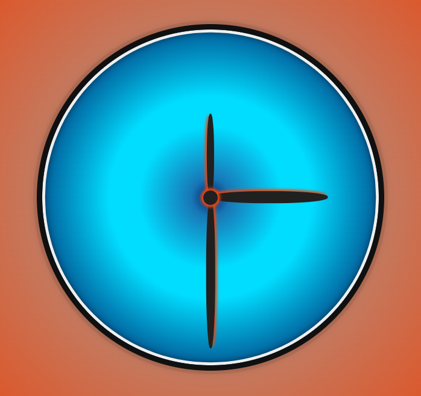
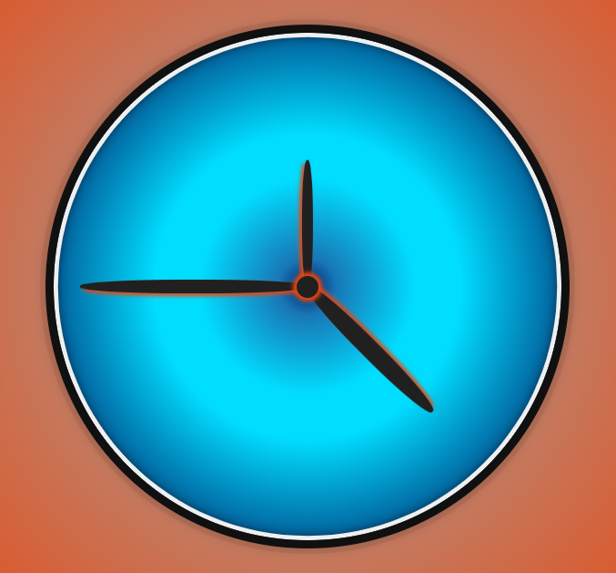
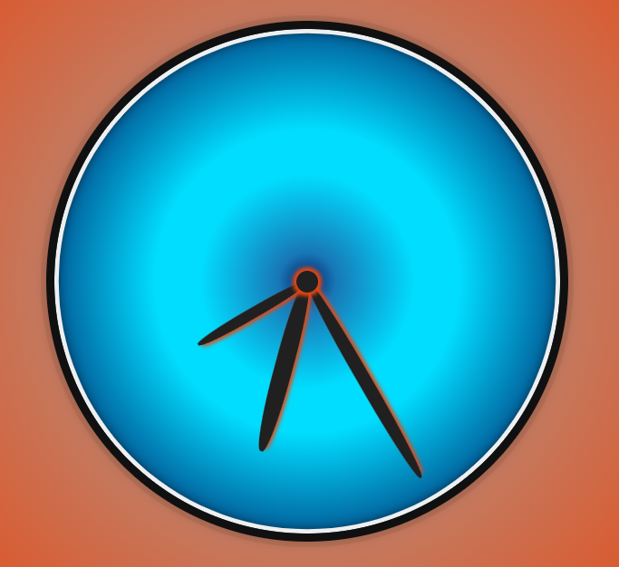
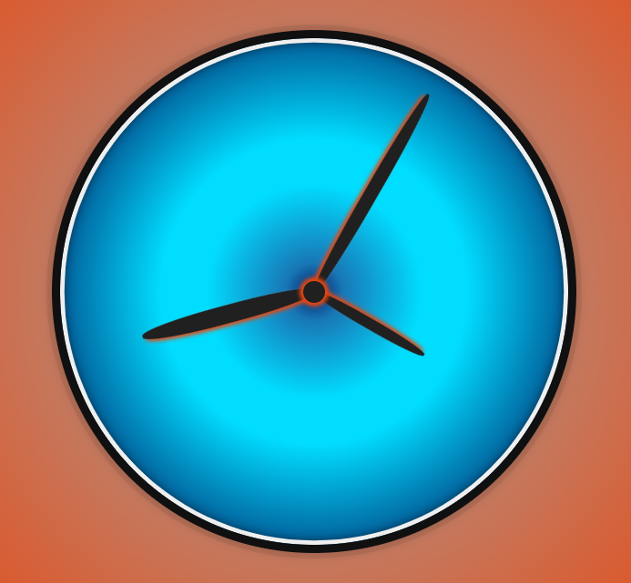
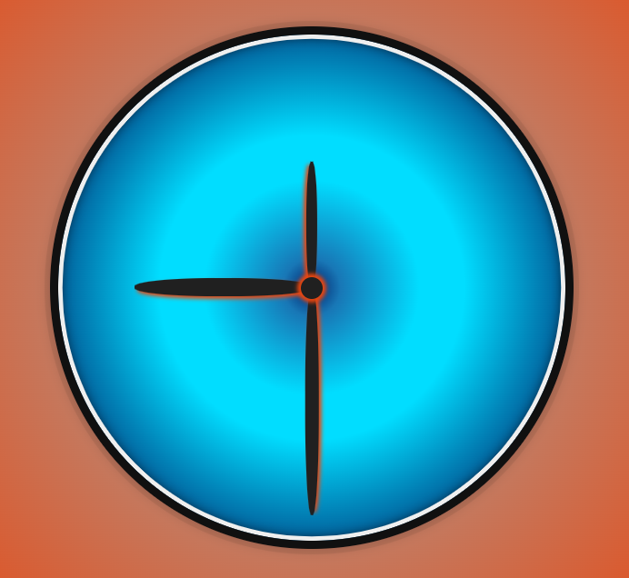

# Decimal Clock

A simple implementation of a decimal clock.

## How does decimal time work?

There are many variations on "decimal time". This particular version relies on
the notion of 10 hours per day, with 100 minutes per hour, and 100 seconds per
minute.

Thus:

|Days|Hours|Minutes|Seconds|
|----|-----|-------|-------|
|0   |0    |0      |1      |
|0   |0    |1      |100    |
|0   |1    |100    |10000  |
|1   |10   |1000   |100000 |

So 1 day consists of 100000 seconds, compared to a normal 24-hour clock, which
consists of 86400 seconds.

1 decimal hour is equivalent to 2 hours and 24 minutes.

## Representation

Rather than 12 separate hours, this clock has 10. You will notice the
second-hand moves faster than a traditional clock - One decimal second is .864
of a "normal" second.

A complete revolution by the hour hand represents a full day, so midday is
denoted by a downward-facing hour hand.

### Example Times

| Time | Display |
| -- | -- |
| 0600 |  |
| 0900 |  |
| 1300 |  |
| 1700 |  |
| 1800 |  |

## Why did I make this?

Why not? I like numbers and I like JavaScript!
